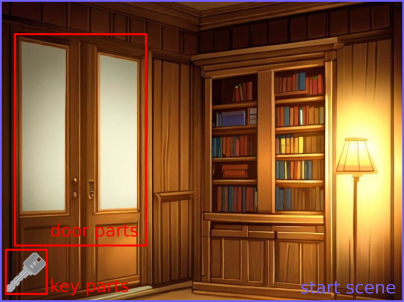
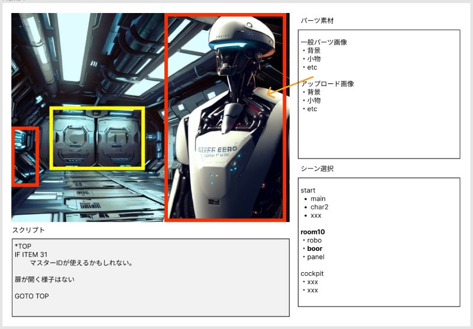

# 脱出ゲームつくーる(仮)


## DEMO用プロトタイプ プログラム

[DEMO脱出ゲーム 開始](https://tatenosystem.github.io/escapegame/)

[DEMO脱出ゲーム シナリオJSON](scenes.js)

## 基本構造



- シーン(scene)
- パーツ(parts)

シーン = 画面。複数シーンでゲームが構成されている。
ゲームは start シーンから開始される。
1シーンは複数のパーツで構成されている。

## スクリプト

シーン(scene)、パーツ(parts)には、各種情報とスクリプトを保持している。
スクリプトフォーマットは暫定（DEMO用）

■ startシーン mainパーツ

スクリプト例

```
どうやら閉じ込められたみたいだ
何も思い出せない...

なんとか脱出しないと...
IF ITEM 20
    このドライバー使えないかな？
```

ゲーム実行時はスクリプトはJSONフォーマットに変換される

```
    'script': [
        [0, 'M', 'どうやら閉じ込められたみたいだ\n何も思い出せない...'],
        [0, 'M', 'なんとか脱出しないと...'],
        [0, 'IF_ITEM', 20],
        [1, 'M', 'このドライバー使えないかな？'],
    ]
```

■ startシーン keyパーツ

```
おや？

鍵が落ちている
拾っておこう
IMAGE_HIDE
FLAG_ON 10
```

ゲーム実行時はスクリプトはJSONフォーマットに変換される

```
    'script': [
        [0, 'M', 'おや？'],
        [0, 'M', '鍵が落ちている\n拾っておこう'],
        [0, 'IMAGE_HIDE'],
        [0, 'FLAG_ON', 10]
    ]
```

## オブジェクト案

シーン

- 背景画像名 image
- パーツ(複数) parts[]
- スクリプト script[]
- 他

パーツ

- 画像名 image
- 状態 status show/hide/etc (hideの場合はscript実行しない)
- パーツ位置 position (x, y, width, height)
- スクリプト script[]
- 他

## エディタイメージ



[partsドラッグテスト](https://tatenosystem.github.io/escapegame/editor_test.html)

## 特記事項

プロトタイプを作成しましたが開発中止となったので、このネタを作りたい人は自由に作ってください。
本プロトタイプ、企画、プログラムは自由に使ってくれて問題ありません。

※ Phaser3 ゲームライブラリに関しては https://phaser.io/ 参照
